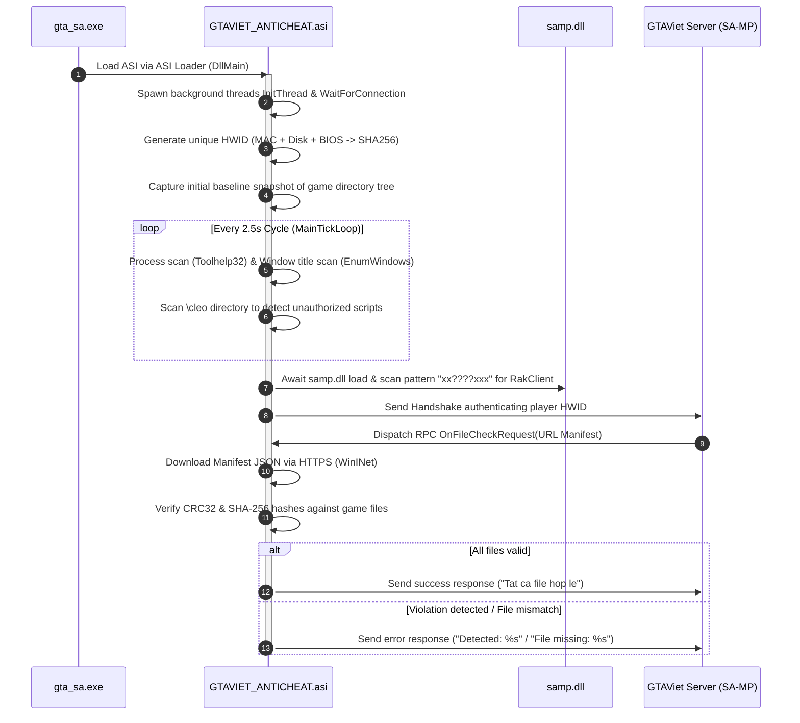

# Reconstructed Source Code: GTAVIET_ANTICHEAT (ngu.asi)

---

## 1. Project Directory Structure

```text
gtaviet_anticheat_asi/
├── include/
│   ├── GtvTypes.h          # Type definitions, violation structs, ManifestEntry & RakNet BitStream
│   ├── HWID.h              # Hardware identifier extraction (MAC, Disk Serial, BIOS) & SHA-256
│   ├── Security.h          # Anti-Debug scans, Process Blacklist, Window Titles & XOR string decryption
│   ├── Integrity.h         # HTTPS Manifest integrity scan (WinINet), file snapshots & \cleo directory
│   ├── RPCHandler.h        # samp.dll hook (pattern scan "xx????xxx"), handles OnFileCheckRequest
│   └── ACCore.h            # Lifecycle coordinator, background threads InitThread, WaitForConnection & Tick loop
├── src/
│   ├── DllMain.cpp         # ASI plugin entry point (DllMain)
│   ├── HWID.cpp            # IPHLPAPI, GetVolumeInformationA, Registry BIOS query implementations
│   ├── Security.cpp        # Custom XOR algorithm (Key 0x39), EnumWindows, Toolhelp32 implementations
│   ├── Integrity.cpp       # WinINet HTTP client, CRC32/SHA256 hasher, snapshot diff implementations
│   ├── RPCHandler.cpp      # RakNet BitStream hook implementation, sends check responses back to server
│   └── ACCore.cpp          # Singleton Core implementation, Dispatcher, and periodic tick verification loop
└── README.md               # Technical analysis documentation and RVA reference table
```

---

## 2. Original Binary Analysis Information

* **Binary Name**: `ngu.asi`
* **Original PDB Path**: `GTAVIET_ANTICHEAT.asi` (`D:\Launcher-dev\Launcher build step\src\client\build\GTAVIET_ANTICHEAT.pdb`)
* **Architecture**: PE32 (x86 32-bit), Machine: `0x014C`
* **Default Image Base**: `0x10000000`
* **Protection / Packer**: **Themida / WinLicense 3.x**
  * Encrypted Sections: Section 0 (`.text`, RVA `0x1000`), Section 1 (`.rdata`, RVA `0x1C000`), Section 2 (`.data`, RVA `0x2B000`).
  * Protective Loader Section: `.boot` (RVA `0x480000`, ~2.8 MB).
* **In-Memory Dynamic Dump Methodology**:
  * Because `Themida` decompresses the original code into RAM when the DLL is loaded via `LoadLibraryA`, a 32-bit child process (WoW64) was utilized to trigger the self-decryption unpack stub, followed by dumping the clean memory regions (`PAGE_EXECUTE_READ` at `0x10001000` and `PAGE_READONLY` at `0x1001C000`).
  * Recovered **208 KB** of clean native x86 machine code along with the complete Microsoft Visual C++ RTTI symbol table.

---

## 3. RVA Cross-Reference Table (Binary vs. Reconstructed Source)

| Module | Function / Component | RVA (`ngu.asi`) | Primary Technical Purpose |
| :--- | :--- | :--- | :--- |
| **Lifecycle** | `DllMain` | `0x10001000` | ASI Plugin entry point, calls `DisableThreadLibraryCalls` and initializes `ACCore` |
| **Core** | `InitThread` | `0x1000b100` | Background monitoring thread: initializes Anti-RE, generates HWID, and captures game folder snapshot |
| **Core** | `WaitForConnection` | `0x1000b200` | Waits for `samp.dll` to load and performs HWID authentication handshake with SA-MP server |
| **Crypto** | `DecryptString` | `0x1000b389` | Dynamic XOR string decryption: `c = raw[i] ^ ((i % key) + key)` (`key = 0x39`) |
| **Security** | `ScanWindows` | `0x1000b370` | `EnumWindows` scanning for window titles containing cheat keywords (`ce tutorial`, `memory scanner`, `sobeit`, etc.) |
| **Security** | `ScanProcesses` | `0x1000bd00` | `CreateToolhelp32Snapshot` enumerating running processes against blacklist (`cheatengine`, `x64dbg`, `ida`, `processhacker`, etc.) |
| **Security** | `CheckDebuggers` | `0x1000d204` | Checks `PEB.BeingDebugged`, `CheckRemoteDebuggerPresent`, and Hardware Breakpoints `DR0-DR7` |
| **Integrity** | `ScanCleoDirectory`| `0x100117a4` | Traverses `\cleo` folder to detect non-whitelisted `.cs` scripts, `.asi`, or `.dll` libraries |
| **Integrity** | `FetchServerManifest`| `0x1001229e` | Downloads JSON Manifest over HTTPS via `WinINet` (`"name"`, `"size"`, `"crc32"`, `"sha256"`) |
| **Integrity** | `VerifyIntegrity` | `0x10013500` | Verifies hash & size of all game files (`"Tat ca file hop le"`, `"File missing"`, `"Detected"`) |
| **RPC** | `OnFileCheckRequest` | `0x10013500` | Handles integrity check RPC requested from SA-MP server via RakNet `BitStream` |
| **HWID** | `GetMacAddress` | `0x10015c00` | Retrieves primary MAC address via `IPHLPAPI.DLL!GetAdaptersInfo` (fallback `"MAC-UNKNOWN"`) |
| **HWID** | `GetDiskSerial` | `0x10015d00` | Retrieves `C:\` Volume Serial Number via `GetVolumeInformationA` (fallback `"DISK-UNKNOWN"`) |
| **HWID** | `GetBiosProductName`| `0x10015e00` | Queries Registry: `HKLM\HARDWARE\DESCRIPTION\System\BIOS\SystemProductName` |
| **HWID** | `GenerateHWID` | `0x10015eca` | Concatenates `MAC|DISK|BIOS` and generates `SHA-256` hash via Windows CryptoAPI |
| **Hook** | `Initialize (Hook)` | `0x10016905` | Resolves `samp.dll` module handle and locates `RakClientInterface` pointer |
| **Hook** | `FindPattern` | `0x100169a5` | Memory byte signature scan with mask `xx????xxx` |

---

## 4. Decrypted Strings Table from Custom XOR Algorithm (Key = 0x39 / 57)

The system utilizes dynamic XOR arithmetic obfuscation to conceal blacklists from static analysis tools:

```text
Decrypted Byte = Raw Byte ^ ((Index % 57) + 57)
```

### Blacklisted Processes & Tools:
* **Cheat Engine**: `cheat engine`, `cheatengine-i386.exe`, `cheatengine-x86_64.exe`, `ce.exe`, `ce tutorial`
* **Disassemblers & Debuggers**: `x64dbg`, `x64dbg.exe`, `x32dbg`, `x32dbg.exe`, `ollydbg.exe`, `ida64.exe`, `ida64`, `ida pro`, `ghidra`, `debugger`
* **RAM Scanners & Memory Tools**: `memory scanner`, `memoryscanner`, `memory hacking`, `art money`, `artmoney`, `artmoney.exe`, `tsearch`, `reclass`, `reclass.exe`, `reclass.net`, `process hacker`, `processhacker.exe`
* **SA-MP Game Cheats & Injected DLLs**: `s0beit`, `sobeit`, `samphack`, `aimbot`, `wallhack`, `speed hack`, `esp hack`, `hack`, `injector`, `injector.exe`, `inject dll`, `dll inject`, `trainer`
* **Automation & Scripting Interpreters**: `autohotkey.exe`, `autohotkey64.exe`, `autohotkeya32.exe`, `autohotkeysc.exe`, `autohotkeyu64.exe`, `ahk.exe`, `.ahk`, `autoit3.exe`, `autoit3_x64.exe`, `lua52.exe`, `lua53.exe`, `luajit.exe`, `python.exe`, `pythonw.exe`, `java.exe`, `javaw.exe`
* **Network Packet Sniffers**: `Wireshark.exe`

### Whitelisted System Processes:
`explorer.exe`, `taskmgr.exe`, `csrss.exe`, `lsass.exe`, `fontdrvhost.exe`, `securityhealthservice.exe`, `ctfmon.exe`, `gta-sa.exe`, `gta_sa.exe`, `steamwebhelper.exe`, `cmd.exe`, `mmc.exe`, `taskhostw.exe`, `msedge.exe`, `smartscreen.exe`, `wmiprvse.exe`, `wt.exe`, `winlogon.exe`, `runtimebroker.exe`.

---

## 5. Complete Anti-Cheat Architecture & Execution Flow


