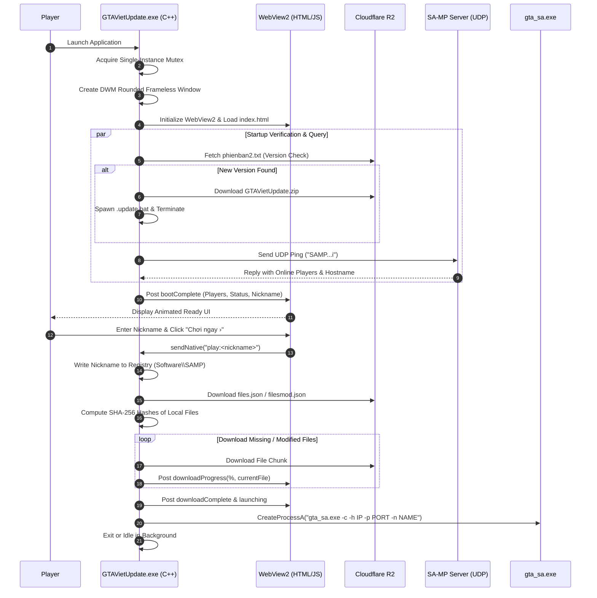

# Reconstructed Source Code: GTAViet Launcher & Updater (GTAVietUpdate.exe)

A reconstructed, organized, and modernized source repository of the **GTAViet SA-MP Client Launcher & Auto-Updater** (`GTAVietUpdate.exe`).

---

## 1. Project Directory Structure

```text
GTAVietLauncher_Updater/
├── CMakeLists.txt                 # CMake configuration for MSVC 2022 / Windows x86
├── README.md                      # Complete architectural and reverse engineering documentation
├── include/                       # Reconstructed C++ header definitions
│   ├── Config.h                   # CDN endpoints (Cloudflare R2), registry keys, default dimensions
│   ├── Downloader.h               # WinHTTP file & string downloader with chunked progress reporting
│   ├── GameLauncher.h             # Registry updater (HKCU\Software\SAMP) & gta_sa.exe process runner
│   ├── HashVerifier.h             # Windows CryptoAPI SHA-256 file verification engine
│   ├── IntegrityChecker.h         # Manifest parser (files.json / filesmod.json) and diff engine
│   ├── SelfUpdate.h               # Auto-update version checker (phienban2.txt) & batch updater
│   ├── ServerQuery.h              # Winsock2 UDP socket query for SA-MP server status & players
│   ├── Types.h                    # Core data models, SettingMode, ManifestEntry, DownloadProgress
│   └── WebViewManager.h           # Microsoft Edge WebView2 host manager & bidirectional IPC bridge
├── src/                           # Native C++ implementations
│   ├── Downloader.cpp             # WinHTTP streaming download implementation
│   ├── GameLauncher.cpp           # Command-line generator and CreateProcessA dispatcher
│   ├── HashVerifier.cpp           # CryptAcquireContext / CryptHashData SHA-256 implementation
│   ├── IntegrityChecker.cpp       # JSON manifest parsing and file validation logic
│   ├── Main.cpp                   # WinMain entry point, DWM borderless window & message loop
│   ├── SelfUpdate.cpp             # PowerShell Expand-Archive batch generator (.update.bat)
│   ├── ServerQuery.cpp            # Raw UDP socket implementation of SA-MP query protocol
│   └── WebViewManager.cpp         # WebView2 initialization, controller bounds, and IPC messaging
├── resources/                     # Native Win32 application resources
│   ├── Launcher.rc                # Resource compiler script embedding HTML and assets
│   ├── resource.h                 # Win32 resource identifier constants (101 to 108)
│   ├── app.ico                    # High-resolution application icon
│   └── app.manifest               # Execution level and DPI awareness manifest
└── web/                           # Extracted & Modularized Modern Frontend
    ├── index.html                 # Modular web interface referencing external CSS & JS
    ├── launcher.html              # Monolithic single-file HTML (for RCDATA resource embedding)
    ├── css/
    │   └── style.css              # Dark/light theme, SVG spinning arcs, and responsive layouts
    ├── js/
    │   └── app.js                 # Frontend event bus, auto-carousel, and WebView2 bridge
    └── assets/                    # Decompiled graphical assets
        ├── logo.png               # GTAViet TDM vector logo (Resource 102)
        ├── Background.png         # High-definition hero splash background (Resource 103)
        ├── youtube.png            # YouTube embed banner asset (Resource 104)
        ├── VK.png                 # VKontakte social media icon (Resource 105)
        ├── instagram.png          # Instagram social media icon (Resource 106)
        ├── telegram.png           # Telegram community icon (Resource 107)
        ├── discord.png            # Discord server link icon (Resource 108)
        └── favicon.ico            # Web app favicon
```

---

## 2. Technical Architecture & Component Analysis

`GTAVietUpdate.exe` is built on a **hybrid C++ and Chromium web architecture**:

```text
┌─────────────────────────────────────────────────────────────────────────┐
│                      GTAVietUpdate.exe (Win32 Host)                     │
│                                                                         │
│  ┌─────────────────────────┐           ┌─────────────────────────────┐  │
│  │   Win32 DWM Window      │           │   Native C++ Subsystems     │  │
│  │   - Borderless Layered  │           │   - WinHTTP Downloader      │  │
│  │   - Rounded Region (RGN)│           │   - CryptoAPI SHA-256       │  │
│  │   - Custom NCHITTEST    │           │   - Winsock2 UDP Query      │  │
│  └────────────┬────────────┘           │   - Game / Registry Dispatch│  │
│               │                        └──────────────┬──────────────┘  │
│               ▼                                       │                 │
│  ┌─────────────────────────┐                          │                 │
│  │ Microsoft Edge WebView2 │ ◄── postMessage(json) ───┤                 │
│  │ (Embedded Chromium)     │ ─── sendNative(cmd)  ───►│                 │
│  └────────────┬────────────┘                                            │
│               ▼                                                         │
│  ┌─────────────────────────┐                                            │
│  │ HTML5 / CSS3 / JS SPA   │                                            │
│  │ - SVG Circular Loader   │                                            │
│  │ - News Slider Carousel  │                                            │
│  │ - Multi-Resolution UI   │                                            │
│  └─────────────────────────┘                                            │
└─────────────────────────────────────────────────────────────────────────┘
```

### Key Technical Subsystems:
1. **DWM Frameless Window & Rounded Regions**:
   * Uses `CreateWindowExW` with `WS_EX_LAYERED` and `WS_POPUP`.
   * Invokes `DwmExtendFrameIntoClientArea` with negative margins to enable native hardware-accelerated composition.
   * `CreateRoundRectRgn(0, 0, width, height, 16, 16)` clips the window into modern rounded corners.
   * Handles `WM_NCHITTEST` so dragging the upper 40px region moves the window naturally.

2. **Embedded Chromium UI (Microsoft Edge WebView2)**:
   * Hosts WebView2 using `CreateCoreWebView2EnvironmentWithOptions` with user data directory set to `WebView2Data`.
   * Transparent window background (`COREWEBVIEW2_COLOR { 0, 0, 0, 0 }`) allows transparent CSS elements to blend seamlessly with the desktop.
   * Eliminates the need for traditional heavyweight GUI libraries like Qt, CEF, or WPF.

3. **Cryptographic Verification**:
   * Windows CryptoAPI (`CALG_SHA_256`) hashes local files in 8 KB streaming chunks without loading massive assets into RAM.
   * Verifies against remote JSON manifests before initiating downloads, ensuring maximum network efficiency.

4. **Network & Auto-Update Subsystem**:
   * **WinHTTP** downloads remote manifests and assets over HTTPS.
   * Remote assets are hosted on **Cloudflare R2 Object Storage** (`r2.dev`).
   * Self-updating is achieved through a self-deleting `.update.bat` script utilizing PowerShell's `Expand-Archive` cmdlet, replacing the binary and restarting without requiring admin UAC elevation if placed in user space.

5. **SA-MP UDP Query Protocol**:
   * Sends raw datagrams containing signature `SAMP`, the target IP, port, and opcode `'i'`.
   * Parses binary server responses to display real-time player counts (`currentPlayers/maxPlayers`) and server status.

---

## 3. Inter-Process Communication (IPC) Protocol

The communication bridge between the JavaScript Frontend and the C++ Host is purely asynchronous:

### A. Web Frontend ➔ Native C++ (`window.chrome.webview.postMessage`)

| Message String | Parameters | Technical Function |
| :--- | :--- | :--- |
| `play:<nickname>` | Player Name string | Saves nickname to registry, runs integrity check, downloads files, and launches `gta_sa.exe`. |
| `cancel` | *None* | Sets cancellation flag; stops active download loops. |
| `setting:<mode>` | Mode ID (`1`, `2`, `3`) | Switches mod policy: `1` = Default, `2` = Custom Mod, `3` = Server Mod (`filesmod.json`). |
| `resize:<preset>`| `800x600` or `1280x720` | Dynamically updates window size (`SetWindowPos`) and recalculates DWM rounded regions. |
| `openurl:<url>` | Target HTTP/HTTPS URL | Calls `ShellExecuteA(..., "open", ...)` to open links in the player's default browser. |
| `minimize` | *None* | Calls `ShowWindow(hWnd, SW_MINIMIZE)`. |
| `close` | *None* | Dispatches `PostQuitMessage(0)` to gracefully terminate the launcher. |

---

### B. Native C++ ➔ Web Frontend (`PostWebMessageAsJson`)

| Event Type | Key JSON Fields | Description |
| :--- | :--- | :--- |
| `boot` | `percent`, `msg` | Reports initialization progress during startup animation. |
| `bootComplete` | `serverQueryOk`, `serverOnline`, `currentPlayers`, `maxPlayers`, `nickname`, `setting`, `resolution` | Dispatches initial server information, cached nickname, and triggers the UI transition. |
| `downloadProgress` | `percent`, `stage`, `file`, `sizes` | Dispatches realtime download progress and animated filename display. |
| `downloadComplete` | `downloaded`, `failed` | Signals that all files are up to date and ready. |
| `launching` | *None* | Disables play button and notifies the UI that the game process is starting. |
| `error` | `msg` | Displays error notifications and resets button states. |

---

## 4. Cloudflare R2 Remote Endpoints

All assets and update manifests are hosted on Cloudflare R2:

| Endpoint URL | Format | Description |
| :--- | :--- | :--- |
| `https://pub-2159475f6e9c446cae5a8cabbb7c98e4.r2.dev/phienban2.txt` | Plain Text | Contains the latest version string of `GTAVietUpdate.exe`. |
| `https://pub-2159475f6e9c446cae5a8cabbb7c98e4.r2.dev/GTAVietUpdate.zip` | ZIP Archive | Compressed update package containing the latest `GTAVietUpdate.exe`. |
| `https://pub-2159475f6e9c446cae5a8cabbb7c98e4.r2.dev/files.json` | JSON Array | Baseline game files manifest (relative paths, sizes, SHA-256 hashes). |
| `https://pub-2159475f6e9c446cae5a8cabbb7c98e4.r2.dev/filesmod.json` | JSON Array | Server modpack files manifest synced to `modloader/playermod/`. |

---

## 5. Embedded Win32 Resource Mapping (RCDATA)

The original executable packs its entire frontend into the `.rsrc` section:

| Resource ID | Resource Type | Exported Filename | Byte Size | Description |
| :--- | :--- | :--- | :--- | :--- |
| `101` | `RCDATA` | `launcher.html` | 53,441 B | Full Single Page Application (HTML/CSS/JS) |
| `102` | `RCDATA` | `logo.png` | 89,134 B | GTAViet TDM logo graphic |
| `103` | `RCDATA` | `Background.png` | 2,578,315 B | Hero high-resolution splash art |
| `104` | `RCDATA` | `youtube.png` | 15,941 B | YouTube social / news button |
| `105` | `RCDATA` | `VK.png` | 2,790 B | VKontakte social button (WebP format) |
| `106` | `RCDATA` | `instagram.png` | 17,618 B | Instagram social button |
| `107` | `RCDATA` | `telegram.png` | 3,279 B | Telegram community button |
| `108` | `RCDATA` | `discord.png` | 66,973 B | Discord community button |
| `201` | `GROUP_ICON` | `app.ico` | 89,134 B | Windows application icon |
| `1` | `RT_MANIFEST`| `app.manifest` | 381 B | Windows UAC Execution Manifest |

---

## 6. Complete Execution Lifecycle



---

## 7. Build Instructions

### Prerequisites
* Windows 10 / 11 (x86 or x64)
* Visual Studio 2022 (v143 toolset) with C++ Desktop Development workload
* CMake 3.20+
* Microsoft Edge WebView2 SDK (or installed Evergreen WebView2 Runtime)

### Building with CMake
```powershell
# Open Developer Command Prompt or PowerShell
cd GTAVietLauncher_Updater

# Generate build configuration
cmake -B build -A Win32

# Compile executable
cmake --build build --config Release
```

The compiled binary `GTAVietUpdate.exe` will be located in `build/Release/GTAVietUpdate.exe`.
